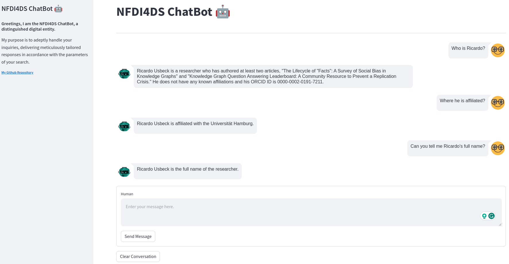
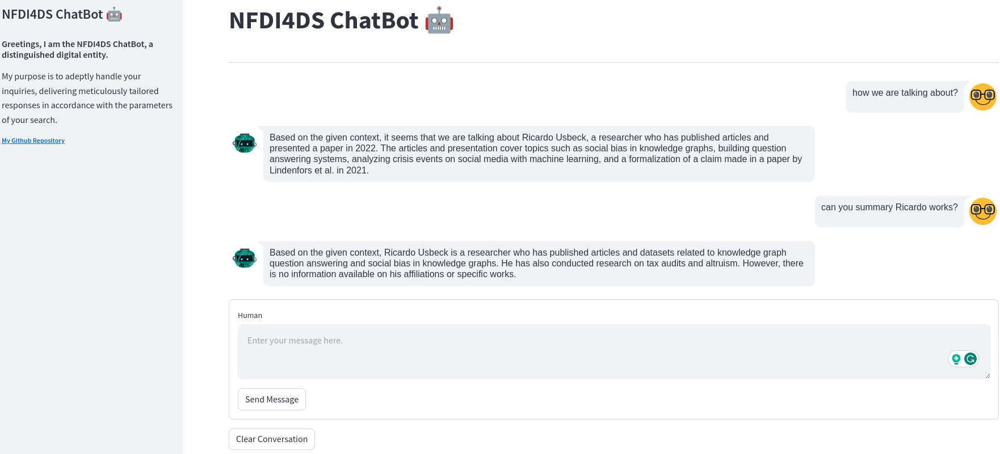

# NFDI Search Engine ChatBot
[](https://github.com/pre-commit/pre-commit)
[](https://github.com/psf/black)
[](https://pycqa.github.io/isort/)

## Demos





## NFDI-ChatBot
The current model operates on Retrieval Augmented Generation (RAG) and integrates optional retrieval techniques like `TFIDF`,
`SVM`, and `Ensemble` to fetch documents for language model (LLM) such as `Vicuna`, enhancing its generation capabilities.

## How  to run

Run this project by simply following the instructions:
```bash
git clone https://github.com/semantic-systems/nfdi-search-engine-chatbot.git
cd nfdi-search-engine-chatbot

conda create -n nfdi_search_engine_chatbot python=3.9
conda activate nfdi_search_engine_chatbot
pip install -r requirements.txt

cp .env-example .env
```
Modify the `.env` file and ad your keys and variables there. The run the app:
```
streamlit run app.py
```
Then, you can now view your streamlit app in your browser.


## Contributors Guidelines

1. Clone the repository to your local machine:
```bash
 git clone https://github.com/semantic-systems/nfdi-search-engine-chatbot.git
 cd nfdi-search-engine-chatbot
```

2. Create a virtual environment with `python=3.9`, activate it, install the required
   dependencies and install the pre-commit configuration:

```bash
conda create -n nfdi_search_engine_chatbot python=3.9
conda activate nfdi_search_engine_chatbot
pip install -r requirements.txt
pre-commit install
```

3. Create a branch and commit your changes:
```bash
git switch -c <name-your-branch>
# do your changes
git add .
git commit -m "your commit msg"
git push
```

4. Merge request to `main` for review.

## How to deploy

**Using Docker**
1. Create a `.env` file similar to `.env-example` and add the `VICUNA_KEY` and `VICUNA_URL` there.
2. Running using Dockerfile
```commandline
docker build -t nfdisearchchatbot .

docker run -d -p 6000:6000 nfdisearchchatbot
```
3. Test whatever everything is set up and works
http://0.0.0.0:5000/ping

**Using docker-compose**
1. Create a `.env` file similar to `.env-example` and add the `VICUNA_KEY` and `VICUNA_URL` there.
2. Run the following command line:
```commandline
docker-compose up
```
3. Test whatever everything is set up and works: http://0.0.0.0:6000/ping


### Request to deployed app.
Request URL: http://0.0.0.0:6000/chat
Request Body:
```json
{
    "question": "You are talking about who?",
    "chat-history": [],
    "search-results": [
        {

        }
    ]
}
```

Respond:
```json
{
    "question": "You are talking about who?",
    "chat-history": [{"input": "You are talking about who?", "output": "......."}],
    "search-results": [
        {

        }
    ]
}
```
