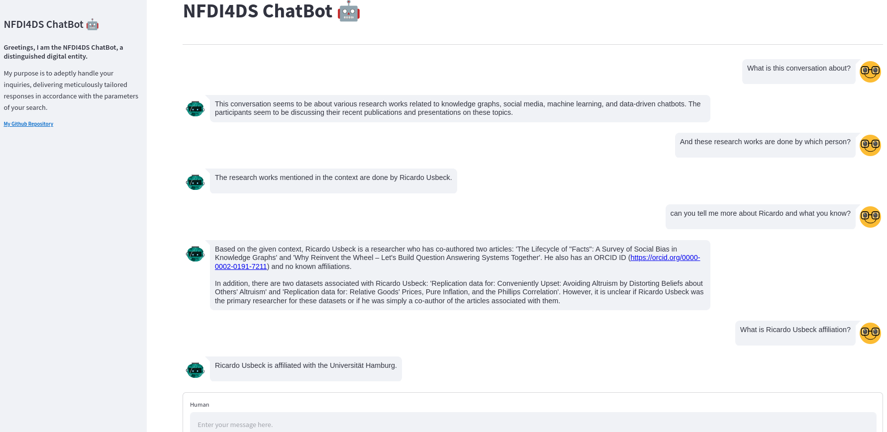

# NFDI Search Engine ChatBot
[](https://github.com/pre-commit/pre-commit)
[](https://github.com/psf/black)
[](https://pycqa.github.io/isort/)

<table>
<tr>
    <td>
      
    </td>
    <td>
      
    </td>
</tr>
</table>

## How  to run

Run this project by simply following the instructions:
```bash
git clone https://github.com/semantic-systems/nfdi-search-engine-chatbot.git
cd nfdi-search-engine-chatbot

conda create -n nfdi_search_engine_chatbot python=3.9
conda activate nfdi_search_engine_chatbot
pip install -r requirements.txt

cp .env-example .env
```
Modify the `.env` file and ad your keys and variables there. The run the app:
```
streamlit run app.py
```
Then, you can now view your streamlit app in your browser.


## Contributors Guidelines

1. Clone the repository to your local machine:
```bash
 git clone https://github.com/semantic-systems/nfdi-search-engine-chatbot.git
 cd nfdi-search-engine-chatbot
```

2. Create a virtual environment with `python=3.9`, activate it, install the required
   dependencies and install the pre-commit configuration:

```bash
conda create -n nfdi_search_engine_chatbot python=3.9
conda activate nfdi_search_engine_chatbot
pip install -r requirements.txt
pre-commit install
```

3. Create a branch and commit your changes:
```bash
git switch -c <name-your-branch>
# do your changes
git add .
git commit -m "your commit msg"
git push
```

4. Merge request to `main` for review.
